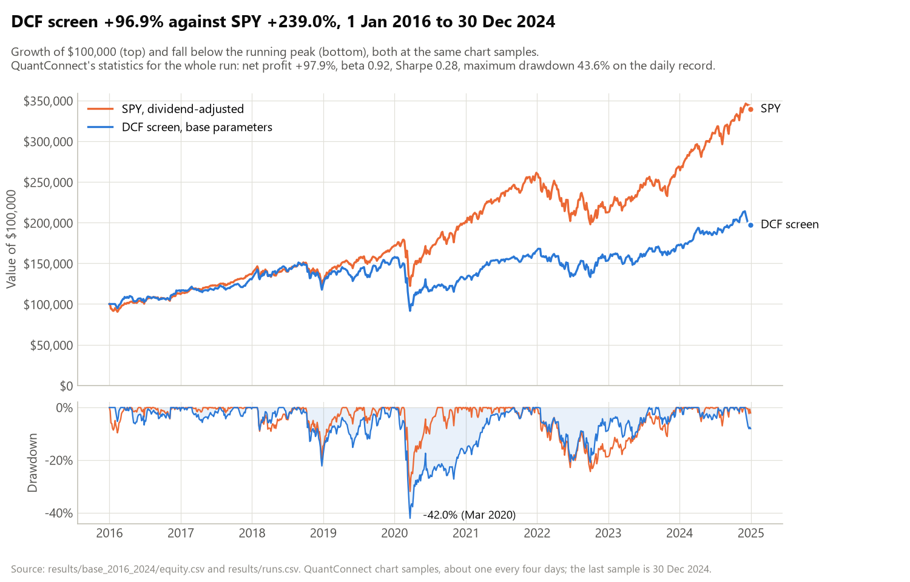
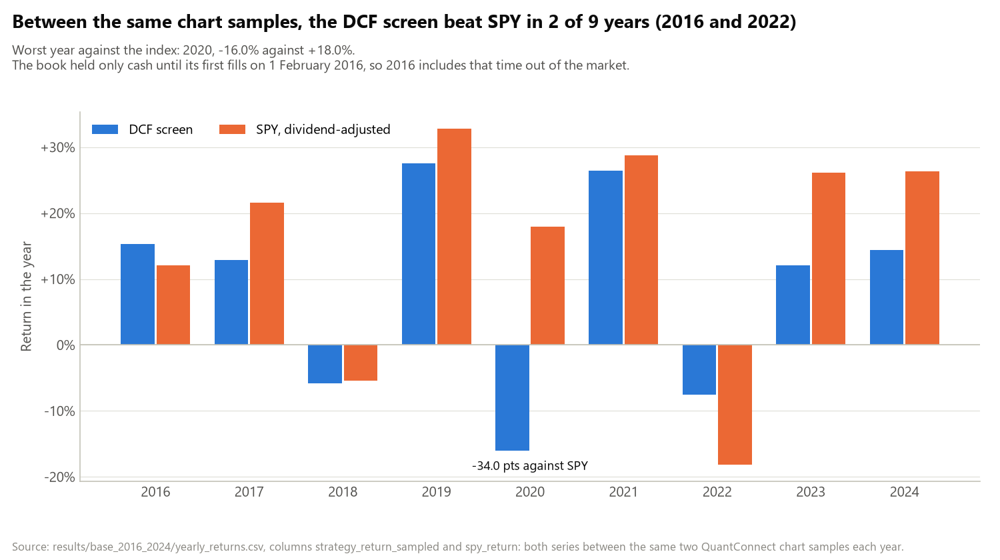
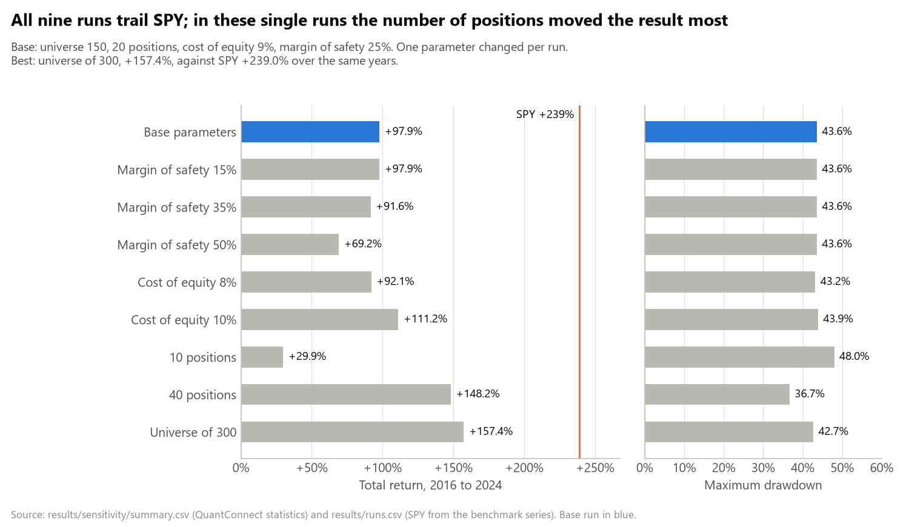
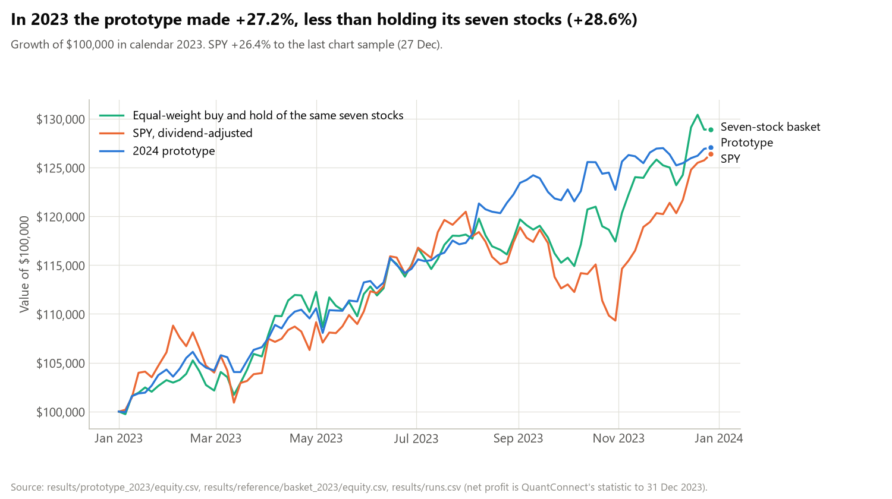

# Automated DCF value screen, point-in-time

A monthly discounted-cash-flow screen on the largest US non-financial companies, backtested on
QuantConnect from 2016 to 2024 using only the Morningstar fundamentals available on each day.

[](pyproject.toml)
[](https://www.quantconnect.com/docs/v2)
[](LICENSE)
[](https://github.com/danyilnep/automated-dcf-point-in-time/actions/workflows/ci.yml)

## Result

USD 100,000 invested on 1 January 2016 ended 2024 at USD 197,850.66, a net gain of 97.851%.
SPY returned +239.03% from 1 January 2016 to QuantConnect's last stored sample of 2024, taken
early on 30 December before the year's last two sessions; between the same two samples the
strategy returned +96.88%.



| Base run, 2016 to 2024 | DCF screen | SPY |
|---|---|---|
| Total return between the same chart samples, 1 Jan 2016 to 30 Dec 2024 | +96.88% | +239.03% |
| Total return to 31 Dec 2024, QuantConnect's statistic | +97.851% | |
| Compound annual return | 7.869% | 14.53% |
| Deepest fall below a peak, both measured on the chart samples (21 Mar 2020) | -42.0% | -31.8% |
| Beta to SPY | 0.916 | 1 |
| Years ahead of SPY between the same chart samples | 2 of 9 | |

The strategy made money and lost to the index: it roughly doubled the capital while SPY more
than tripled it, and it fell further than SPY in March 2020.

Strategy figures are QuantConnect's statistics in [`results/runs.csv`](results/runs.csv),
except in the rows that say they use the chart samples; every SPY figure comes from the
samples. The same run has a Sharpe ratio of 0.279, a maximum drawdown of 43.6% on the daily
record, USD 1,388.79 of fees over 1,340 orders, and an information ratio against SPY of -0.567
with a tracking error of 7.6% a year. Its probabilistic Sharpe ratio is 0.433%. That is
QuantConnect's estimate of the probability that the true Sharpe ratio exceeds a positive
reference value; it is not the probability of a gain and not a comparison with SPY (with a
reference of zero, any positive Sharpe ratio would score above 50%).

SPY is QuantConnect's dividend-adjusted benchmark series, which exists only at QuantConnect's
chart samples, about one every four days. The sample-based rows use the same samples for both
series ([`equity.csv`](results/base_2016_2024/equity.csv), columns `equity` and
`spy_benchmark`). The book held only cash until its first fills on 1 February 2016, while SPY
fell 4.9% in January; from the 30 January sample to the last one, SPY returned +256.55%
against the strategy's +96.88%.

## What this is

Two pieces of work on one idea.

1. A point-in-time rebuild of a DCF screen that the quant team of Mercury Capital Management
   (MCM), St Andrews, built in spring 2024. The rebuild screens the 150 largest
   eligible companies every month using only the statements QuantConnect held on the day.
2. An audit of the 2024 prototype, which found its +27.2% for 2023 meaningless as evidence
   for the model: its fair values used fiscal-2023 statements and the last close of 2023, none
   of which existed when its January 2023 trades were made, its buy and sell rules overlapped,
   and its seven hand-picked stocks returned +28.6% when simply bought once and held. The full
   audit is [docs/audit-2024-prototype.md](docs/audit-2024-prototype.md); the 2024 code is kept
   verbatim in [`received/`](received/), with the deck, from which the package parts holding
   personal data, the other team members' names on the title slide and the thumbnail image were
   removed.

The rebuild is published as a working, auditable pipeline. It shows no edge over the index.

## How it works

On the first trading day of each month the algorithm takes the largest US companies outside
finance and real estate, values each one with a five-year EBITDA-based DCF built from the
trailing-twelve-month Morningstar statements QuantConnect held on that day, and compares the
implied equity value with the market capitalisation. It holds up to 20 names in equal slots,
buying at a 25% discount to implied value and selling at implied value. The full rule set, with
every formula, bound and default, is in [docs/methodology.md](docs/methodology.md).

1. **Universe:** the 150 largest primary US shares by market capitalisation with a price above
   USD 5, excluding Morningstar's financial services and real estate sectors, refreshed at the
   first universe selection of each month. That selection runs at midnight after a trading
   session, so in the 32 of 108 months whose previous month ends on a weekend or holiday it
   comes the day after the rebalance, which then trades on last month's list
   ([methodology](docs/methodology.md#refresh-and-rebalance-order)). QuantConnect's universe
   includes companies that were later delisted.
2. **Inputs:** trailing-twelve-month EBITDA, capital expenditure, change in working capital,
   pretax income, tax provision and interest expense; latest quarter-end debt and cash;
   one-year EBITDA growth; all from the Morningstar record for that day.
3. **Valuation:** free cash flow is EBITDA times a margin, EBITDA grows at a bounded rate for
   five years, the terminal value is year-five EBITDA at the universe's median EV/EBITDA, and
   everything is discounted at a WACC with one 9% cost of equity:

   ```text
   tax        t = tax provision / pretax income, bounded to [0, 35%]; 21% if not computable
   margin     m = 1 - t - |capex| / EBITDA - (-change in WC) / EBITDA
                  (capex share bounded to [0, 0.8], working-capital share to [-0.3, 0.3])
   growth     g = one-year EBITDA growth, bounded to [-5%, +15%]; 3% if missing
   discount   WACC = E/(E+D) * 9% + D/(E+D) * r_d * (1 - t), at least 5%
                  (r_d = interest / debt, bounded to [1%, 12%])
   exit       X = median EV/EBITDA of the universe that day, bounded to [6, 14]
   equity     V = sum over k=1..5 of m * EBITDA_k / (1+WACC)^k
                  + X * EBITDA_5 / (1+WACC)^5 - debt + cash
   upside     U = V / market cap
   ```

   The terminal term carries most of the value: 78% of the enterprise value in the worked
   example in [`tests/test_dcf_model.py`](tests/test_dcf_model.py). So U mostly compares the
   universe's median multiple, applied to five years of bounded growth, with the company's own
   market value; it works much like a growth-adjusted relative EV/EBITDA screen.

4. **Trading:** 30 minutes after the open, sell every holding whose U has fallen to 1 or below
   or that can no longer be valued; then fill the free slots of 20 with the highest-upside
   names where U is at least 1 / (1 - 0.25) = 1.333. Every name is set to 5% of equity and
   unfilled slots stay in cash. Orders fill at that day's close. A held name that drops out of
   the universe is sold at the rebalance's close when the new list arrives before the
   rebalance, and at the next day's open when it arrives the day after.
5. **Costs:** QuantConnect's default Interactive Brokers fee model (USD 0.005 a share, USD 1
   minimum per order in the base run's orders) and no slippage model. Share counts are in
   QuantConnect's split- and dividend-adjusted units, so the per-share fee is charged on
   adjusted counts, which for a company that split later are larger than the shares that
   traded at the time.

The code is split in two: [`main.py`](main.py) holds the QuantConnect parts (universe,
Morningstar reads, schedule, orders) and [`dcf_model.py`](dcf_model.py) the valuation
arithmetic in plain Python, which [`tests/`](tests/) checks without LEAN.

## Results by year



| Year | DCF screen, calendar year | DCF screen, SPY's dates | SPY | Difference, points |
|---|---|---|---|---|
| 2016 | +15.18% | +15.32% | +12.12% | +3.20 |
| 2017 | +12.90% | +12.86% | +21.57% | -8.71 |
| 2018 | -4.17% | -5.79% | -5.39% | -0.40 |
| 2019 | +25.55% | +27.53% | +32.78% | -5.25 |
| 2020 | -15.98% | -16.00% | +17.97% | -33.97 |
| 2021 | +26.48% | +26.47% | +28.73% | -2.26 |
| 2022 | -7.64% | -7.55% | -18.18% | +10.63 |
| 2023 | +11.97% | +12.03% | +26.18% | -14.15 |
| 2024 | +15.06% | +14.44% | +26.29% | -11.85 |

Between the same chart samples the strategy was ahead of SPY in 2016 and 2022 and behind it in
the other seven years; 2020 alone cost 34 points. "Calendar year" is the strategy's exact
return from month-end equity. SPY is only available on chart samples, so the comparison uses
the strategy over the same two samples ("SPY's dates"), and the difference is taken between
those two columns. Source:
[`results/base_2016_2024/yearly_returns.csv`](results/base_2016_2024/yearly_returns.csv), with
monthly returns, orders and trades in the same folder.

Two of the nine comparisons need a qualification:

- 2016: the lead comes from January, when the book was still all cash (every member was new
  and had no price bar at the first rebalance) while SPY fell 4.9%. From the 30 January sample
  to the last sample of 2016 the strategy returned +15.32% and SPY +17.91%.
- 2018: the last sample of the year was taken on 30 December, after the close of 28 December,
  and misses the session of 31 December. The strategy's equity rose 1.6% from that sample to
  its year-end value, more than its 0.40-point gap to SPY, so these samples do not settle which
  was ahead in 2018.

## Parameter sensitivity



Eight more runs of the same code, each with one project parameter moved from the base
(universe 150, 20 positions, cost of equity 0.09, margin of safety 0.25). They did not all run
on the same LEAN build: the base run and the runs with margin of safety 0.15 and 0.35 and cost
of equity 0.08 ran on v2.5.0.0.18116, the other five on v2.5.0.0.18126. On the base parameters
the build change alone moved the Sharpe and Sortino ratios from 0.279 to 0.28 and the
probabilistic Sharpe ratio from 0.433% to 0.439%, and left every order and the return unchanged
([data checks](docs/data-checks.md#reproduction-of-the-base-run)).

| Run | Net profit | CAGR | Sharpe | Max drawdown | Beta | Orders |
|---|---|---|---|---|---|---|
| Base | +97.851% | 7.869% | 0.279 | 43.6% | 0.916 | 1,340 |
| Margin of safety 0.15 | +97.851% | 7.869% | 0.279 | 43.6% | 0.916 | 1,340 |
| Margin of safety 0.35 | +91.610% | 7.486% | 0.262 | 43.6% | 0.911 | 1,345 |
| Margin of safety 0.50 | +69.222% | 6.013% | 0.199 | 43.6% | 0.867 | 1,262 |
| Cost of equity 0.08 | +92.085% | 7.515% | 0.263 | 43.2% | 0.915 | 1,309 |
| Cost of equity 0.10 | +111.204% | 8.654% | 0.314 | 43.9% | 0.924 | 1,365 |
| 10 positions | +29.927% | 2.949% | 0.070 | 48.0% | 0.912 | 891 |
| 40 positions | +148.220% | 10.619% | 0.425 | 36.7% | 0.870 | 1,558 |
| Universe of 300 | +157.427% | 11.067% | 0.403 | 42.7% | 0.935 | 1,342 |
| SPY, same period | +239.03% | 14.53% | | | 1 | |

- No run beats SPY. The best, a universe of 300, returned +157.427% against +239.03%.
- In these runs the number of positions moved the result most: +29.927% with 10, +97.851% with
  20 and +148.220% with 40, a spread of 118.3 points, and the drawdown fell from 48.0% to 36.7%
  as the book widened. Doubling the universe to 300 made the next largest change (+59.6 points
  over the base, one alternative value tested). The two valuation parameters moved it less:
  28.6 points across margins of safety from 0.15 to 0.50 and 19.1 points across costs of equity
  from 0.08 to 0.10.
- The margin of safety does not bind below 0.25: at 0.15 the order and trade lists are
  identical to the base run's, so no name with an upside between the two buy hurdles ever
  reached a free slot. Raising it does bind: 6.2 points less than the base at 0.35 and 28.6
  points less at 0.50.

Each figure is a single backtest path. No subperiod split, bootstrap or confidence interval was
computed, so the order of the parameters above describes these runs and is not a tested
ranking.

The base run, named `run1` in QuantConnect, is the earliest of the nine (created 22 September
2026, the variants on 22 and 24 September), so the variants came after the base values were
set and were not used to choose them. QuantConnect's backtest list for the project holds ten
backtests: these nine and the re-run of the refactored code, all of them in `results/runs.csv`,
so every backtest in the rebuild's project is accounted for and no other parameter values were
run there
([`results/checks/backtest_lists.csv`](results/checks/backtest_lists.csv)). Source:
[`results/sensitivity/summary.csv`](results/sensitivity/summary.csv), with each run's
statistics, equity, orders and trades in `results/sensitivity/<variant>/`.

## The 2024 prototype



The prototype valued seven hand-picked stocks once, with a yfinance script run by hand in April
2024, and pasted the seven fair values into a QuantConnect algorithm that traded them through
calendar 2023. Its final backtest returned +27.233% with a Sharpe ratio of 1.878.

| Calendar 2023 | Prototype | Same seven stocks, equal weight, held | SPY |
|---|---|---|---|
| Net return | +27.233% | +28.615% | +26.18% |
| Sharpe ratio | 1.878 | 1.312 | |
| Maximum drawdown | 2.6% | 4.8% | |
| Orders | 363 | 7 | |
| Fees | USD 363.04 | USD 7.50 | |

What the [audit](docs/audit-2024-prototype.md) found:

- **Look-ahead:** the fair values used fiscal-2023 annual statements, published between July
  2023 and early 2024, and the last close of 2023. None of it existed when the backtest made its
  January 2023 trades.
- **Overlapping bands:** buy when 0.95 x price < fair value, sell when 1.05 x price > fair
  value, so any price within about 5% of fair value satisfies both. The run placed 363 orders on
  six traded names, and 165 of the 181 round trips in its trade list closed within one weekday.
- **Linear extrapolation:** the average of two years of EBITDA change was extended in a straight
  line for five years. Exxon's fair value came out at USD 776.87 against its only fill at
  USD 100.41; the sell rule needed a close above USD 739.88, so the position was held all year.
- **Capex sign:** capital expenditure entered with the wrong sign, which added it back to free
  cash flow.
- **Hand-picked list:** holding the same seven names in equal weights without trading made more
  money (+28.615%) than the strategy.
- **Forty backtests in two days:** 15 stopped with an error and 25 completed, with net profits
  from +2.967% to +27.233%; the published figure is the highest of the 25
  ([`results/checks/backtest_lists.csv`](results/checks/backtest_lists.csv),
  [appendix A](docs/audit-2024-prototype.md#appendix-a-the-40-backtests-of-3-and-4-april-2024)).

The table in [How the rebuild addresses each finding](docs/audit-2024-prototype.md#how-the-rebuild-addresses-each-finding)
maps each defect to its replacement. Sources:
[`results/prototype_2023/`](results/prototype_2023/),
[`results/reference/basket_2023/`](results/reference/basket_2023/) and `results/runs.csv`. SPY's
calendar-2023 return comes from the base run's benchmark samples at the 2022 and 2023 year-end
closes ([`yearly_returns.csv`](results/base_2016_2024/yearly_returns.csv)); the prototype run's
own benchmark series stops at a sample on 27 December, where it stands at +26.39%.

## Limitations

Details are in [docs/limitations.md](docs/limitations.md).

- An undecomposed shortfall at market beta: a long-only book with a beta of 0.916. The gap to
  SPY has several candidate causes that no run separates: equal weights against SPY's
  capitalisation weights in years led by the largest companies, the excluded financial and
  real-estate sectors, a 20-name book, and sector concentration (9 of the 20 holdings after the
  January 2020 rebalance were energy companies). A value-against-growth effect fits the result
  but was not measured. The result is not evidence that the model picks winners.
- One cost of equity: 9% for every company on every date, with no link to risk or rates.
- Thin inputs: one trailing year of EBITDA and one year of growth, carried five years ahead.
  Missing Morningstar fields fall back to defaults, and the runs do not record how often. The
  one-year growth field was checked on QuantConnect and is a decimal fraction, as the bounds
  require ([data checks](docs/data-checks.md#ebitda-growth-is-a-decimal-fraction)); the
  three-year and default periods the code falls back to were not checked.
- Simple execution: default per-share fees charged on adjusted share counts, fills at the
  close, no slippage model, monthly rebalance.
- Refresh after the rebalance: in 32 of the 108 months the new universe arrives the day after
  the rebalance, which trades on last month's list; the names the new list drops are sold at
  the next open (18 sales, three of them whole positions held for one session). Removing this
  needs a code change and new runs.
- Hindsight in the design: the model and its bounds were written in 2026 by people who knew
  how 2016 to 2024 went. There is one nine-year path and no holdout. Over that path the
  information ratio against SPY is -0.567, about 1.7 standard errors below zero (the ratio
  times the square root of nine years), so even the shortfall is not statistically firm.
- No sector or factor constraints, and no factor regression, so the return is not split between
  the valuation signal and sector, size or style.

[What is point-in-time and what is not](docs/methodology.md#what-is-point-in-time-and-what-is-not)
lists exactly which inputs are dated.

## Reproduce

### On QuantConnect

1. Create a new Python algorithm project.
2. Replace its `main.py` with [`main.py`](main.py) and add a file named `dcf_model.py` with the
   contents of [`dcf_model.py`](dcf_model.py). Both files are needed: `main.py` imports
   `dcf_model`.
3. Optionally add project parameters `universe_size`, `max_positions`, `cost_of_equity` and
   `margin_of_safety`. Without them the code uses the base values 150, 20, 0.09 and 0.25; the
   recorded base run passed no parameters.
4. Run a backtest. The dates (1 January 2016 to 31 December 2024) and the USD 100,000 of cash
   are set in the code. Compare the statistics with the `dcf__base` row of
   [`results/runs.csv`](results/runs.csv); the `rerun__dcf_base` row shows what LEAN
   v2.5.0.0.18126 gave for the same code (Sharpe and Sortino ratios 0.28 and probabilistic
   Sharpe ratio 0.439% where the recorded run has 0.279, 0.279 and 0.433%; its other 24
   QuantConnect statistics are the same).

### With the LEAN CLI

[`config.json`](config.json) makes the repository folder a LEAN project and carries the four
parameters at their base values.

```bash
pip install lean
lean login
lean init                     # in an empty folder: creates a LEAN workspace
git clone https://github.com/danyilnep/automated-dcf-point-in-time
lean cloud backtest automated-dcf-point-in-time --push   # runs on QuantConnect's servers
lean backtest automated-dcf-point-in-time                # runs locally
```

A local run needs QuantConnect's US equity prices and US fundamentals in the workspace's data
folder. The LEAN CLI route has not been tested with this repository.

### Local checks

```bash
pip install -r requirements-dev.txt   # Python 3.11 or later
ruff check .
pytest -q
python analysis/check_docs.py         # relative links and images in the Markdown resolve
```

The tests work through one valuation by hand, cover every bound and every case that returns no
valuation, and require `dcf_model` to give exactly the same results as a copy of the valuation
code QuantConnect ran, on 5,000 random inputs. They also require `main.py` and `dcf_model.py`
to be byte-identical to the published copies of the files QuantConnect stored with the re-run of
the base parameters (below), which differ from the files as run only in one docstring paragraph,
rewritten to leave out the other team members' names, so the published code stays the code that
re-ran.

### Rebuilding results and figures

```bash
python analysis/build_results.py --check   # compare a fresh build with the files in results/
python analysis/build_results.py           # rewrite every derived file from results/raw
python analysis/make_figures.py            # redraw figures/ from the derived CSVs
```

`build_results.py` reads only `results/raw/` and first checks every raw file against
`results/raw/MANIFEST.json`. CI runs the lint, the tests, `check_docs.py` and `--check` on every
push; it does not redraw the figures. They were drawn on Windows with the Segoe UI font; where
that font is missing, matplotlib falls back to DejaVu Sans, so a redraw elsewhere shows the same
data and text but is not the same file byte for byte.
[`results/README.md`](results/README.md) describes every file and column.

## Repository layout

```text
.
├── main.py                  QuantConnect algorithm: universe, Morningstar reads, schedule, orders
├── dcf_model.py             valuation arithmetic, standard library only
├── config.json              LEAN CLI project file with the four parameters
├── tests/
│   ├── test_dcf_model.py    hand-worked example, bounds, equality with the recorded code
│   ├── test_published_code.py  main.py and dcf_model.py against the re-run's stored code
│   ├── test_build_results.py  helpers of build_results.py
│   └── test_check_docs.py   check_docs.py on a small synthetic repository
├── analysis/
│   ├── build_results.py     results/raw to every derived file in results/
│   ├── make_figures.py      results/ to figures/
│   └── check_docs.py        links and images in the Markdown resolve, no placeholders
├── results/
│   ├── README.md            layout, provenance and column definitions
│   ├── runs.csv             one row per backtest
│   ├── base_2016_2024/      base run: statistics, equity, orders, trades, yearly and monthly
│   │                        returns, and QuantConnect's report
│   ├── sensitivity/         summary.csv and one folder per variant
│   ├── prototype_2023/      the 2024 prototype's final run, with the code it ran and
│   │                        QuantConnect's report
│   ├── reference/
│   │   └── basket_2023/     equal-weight buy and hold of the prototype's seven stocks
│   ├── checks/
│   │   ├── reproduction/    the base run against a re-run of this code and a control run
│   │   ├── data/            probe backtests on the growth units and the market-cap updates
│   │   └── backtest_lists.csv  every backtest in the projects involved, published or why not
│   ├── provenance/          code_hashes.json: each code file's SHA-256 as run and as published
│   └── raw/                 QuantConnect exports, gzip-compressed, with MANIFEST.json
├── figures/                 the four charts in this README
├── docs/
│   ├── methodology.md       every rule and formula
│   ├── data-checks.md       growth units, market-cap updates, reproduction of the base run
│   ├── audit-2024-prototype.md
│   ├── limitations.md
│   └── screenshots/         checklist for the QuantConnect screenshots
├── received/                the 2024 prototype's code, deck and images (not MIT licensed)
├── .github/workflows/ci.yml lint, tests, documentation check, results check
├── pyproject.toml           ruff and pytest settings
├── requirements-dev.txt     pinned packages for the local checks
└── LICENSE
```

## Data provenance

Every backtest result in this repository comes from QuantConnect backtests exported through
QuantConnect's web API on 25 September 2026 from Danyil Nepyivoda's QuantConnect account. The
exports are stored compressed in [`results/raw/`](results/raw/), and
[`MANIFEST.json`](results/raw/MANIFEST.json) records the SHA-256 of each file as published. In
the exports whose embedded code carried them, one docstring paragraph was rewritten to leave out
the names of the other 2024 team members; every other byte is as QuantConnect returned it, and
[`results/provenance/code_hashes.json`](results/provenance/code_hashes.json) records the SHA-256
of each code file as run on QuantConnect and as published.
QuantConnect's list of every backtest in each project involved was exported the same way
(`results/raw/backtest_lists.json.gz`).
[`results/checks/backtest_lists.csv`](results/checks/backtest_lists.csv) gives each backtest in
the seven projects behind this repository with the published run it is or the reason it is not
published. Every backtest of the rebuild's project 36836412 is in `results/runs.csv`. Of the
prototype project's 40, only the final run was exported; the other 39 (15 stopped with an
error, 24 are earlier completed runs) are listed with their headline statistics
([appendix A of the audit](docs/audit-2024-prototype.md#appendix-a-the-40-backtests-of-3-and-4-april-2024)).

| Run | QuantConnect project | Backtest | Created |
|---|---|---|---|
| Base, 2016 to 2024 | 36836412 | `54b5e0649da4a9cbf3f7dce6c409c7fe` | 22 Sep 2026 |
| Eight sensitivity runs | 36836412 | listed in [`summary.csv`](results/sensitivity/summary.csv) | 22 and 24 Sep 2026 |
| 2024 prototype, calendar 2023 | 17552945 | `e472f920b9bb72dbb8024af7d95f1c04` | 4 Apr 2024 |
| Reference basket, calendar 2023 | 36922759 | `d611b8a8fb19c48188e250a4c75a5297` | 24 Sep 2026 |
| Re-run of this repository's code, base parameters | 36836412 | `4dbfbc74cea08eaceca427b01447a19d` | 24 Sep 2026 |
| Control: the recorded `main.py` re-run | 36923806 | `48e014812a2a5dcdc8810e80d44d3637` | 25 Sep 2026 |

SHA-256 of the `main.py` each run executed, as run on QuantConnect (`code_sha256_as_run` in
`runs.csv`; `code_sha256_published` is the hash of the published copy in `results/raw/`):

```text
4f7f49ed7adf30b3e57d0cbc4a754d47fd365cfa9d62e52d8ea7497a30ffa599  base and sensitivity runs, as run on QuantConnect
c455f69dffaa58f4380f51fd2e3d5a179753265b879f72aaba32da6eab6ec21f  base and sensitivity runs, published copy (results/raw/dcf__base.json.gz)
60ac793e7d500d9e01120d3948c90f61f63408d548f1a37da9818d1fd3134c06  prototype run, as run and published (identical to received/main.py)
7fa49674a4c1163e3b503106310aa0d8fa5e725bfe8fa45f27783bd5c288e078  reference basket run, as run and published (results/reference/basket_2023/code/main.py)
```

The current `main.py` and `dcf_model.py` are the recorded `main.py` split in two with every
expression kept; `tests/test_dcf_model.py` holds a copy of the recorded valuation code and
checks the two against each other, and `tests/test_published_code.py` checks that both files
are byte-identical to the published copies of the ones QuantConnect stored with the re-run below
(as run on QuantConnect: `main.py` `a567e72b...` and `dcf_model.py` `c9313f30...`; published
copies, the files in this repository: `56cadd09...` and `d21b127d...`).

The refactored code was re-run on QuantConnect with the base parameters (backtest
`4dbfbc74cea08eaceca427b01447a19d`) and reproduced all 1,340 orders, all 1,114 closed trades and
24 of QuantConnect's 27 statistics; the Sharpe and Sortino ratios moved from 0.279 to 0.28 and
the probabilistic Sharpe ratio from 0.433% to 0.439%. A control run of the recorded `main.py` on
the same engine, LEAN v2.5.0.0.18126 against v2.5.0.0.18116 for the recorded run, gave exactly
the re-run's statistics, so the change comes from QuantConnect's side and not from the refactor.
Details are in [docs/data-checks.md](docs/data-checks.md#reproduction-of-the-base-run) and
[`results/checks/reproduction/`](results/checks/reproduction/).

Prices in the order logs are QuantConnect's split- and dividend-adjusted prices as held when each
backtest ran, so they differ from the prices quoted at the time. Order quantities are in the
same adjusted units.

## Screenshots

QuantConnect's own backtest reports for the base run and the prototype run are in
[`results/base_2016_2024/qc_report.html`](results/base_2016_2024/qc_report.html) and
[`results/prototype_2023/qc_report.html`](results/prototype_2023/qc_report.html); download them
and open them in a browser.

<!--  -->
<!--  -->
<!--  -->

## Credits and licence

- 2024 prototype: the quant team of Mercury Capital Management (MCM), St Andrews, spring 2024,
  with Danyil Nepyivoda as a member.
- Audit and rebuild: Danyil Nepyivoda with Claude (Anthropic), September 2026.
- Engine and data: QuantConnect LEAN, with Morningstar fundamentals through QuantConnect.

The [MIT licence](LICENSE) covers the code and documentation written for this repository. Two
kinds of file are included as records and are not relicensed: the 2024 code, deck and images in
[`received/`](received/), reproduced as a record of the MCM quant team's 2024 work (see
[`received/README.md`](received/README.md)), and QuantConnect's generated backtest reports,
`qc_report.html` in [`results/base_2016_2024/`](results/base_2016_2024/) and
[`results/prototype_2023/`](results/prototype_2023/).
